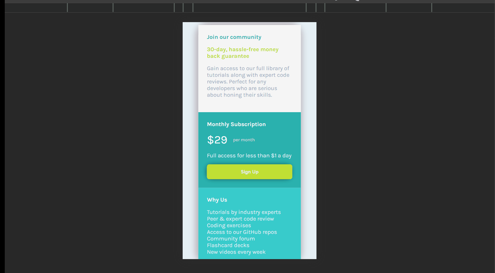

# Frontend Mentor - Single price grid component solution

This is a solution to the [Single price grid component challenge on Frontend Mentor](https://www.frontendmentor.io/challenges/single-price-grid-component-5ce41129d0ff452fec5abbbc). Frontend Mentor challenges help you improve your coding skills by building realistic projects.

## Table of contents

- [Frontend Mentor - Single price grid component solution](#frontend-mentor---single-price-grid-component-solution)
  - [Table of contents](#table-of-contents)
  - [Overview](#overview)
    - [The challenge](#the-challenge)
    - [Screenshot](#screenshot)
    - [Links](#links)
  - [My process](#my-process)
    - [Built with](#built-with)
    - [What I learned](#what-i-learned)
    - [Useful resources](#useful-resources)
  - [Author](#author)
  - [Acknowledgments](#acknowledgments)

## Overview

### The challenge

Users should be able to:

- View the optimal layout for the component depending on their device's screen size
- See a hover state on desktop for the Sign Up call-to-action

### Screenshot

Please find the screenshot of the application below:

### Links

- Solution URL: [SOLUTION_URL](https://github.com/mandy8055/frontend-mentor-challenges/single-price-grid-component)
- Live Site URL: [LIVE_SITE](https://mandy8055.github.io/frontend-mentor-challenges/single-price-grid-component/public/index.html)

## My process

### Built with

- Semantic HTML5 markup
- SASS
- node
- `pnpm dev` or `npm run dev` in development mode to fire up the application.

**Note: These are just examples. Delete this note and replace the list above with your own choices**

### What I learned

While working on this challenge I learned:

- **Box-sizing concept**
- **--open flag vs --entry-file flag in live-server module**

### Useful resources

- [Box shadow generator](https://www.cssmatic.com/box-shadow) - This helped me in generating the box shadow for my card and button automatically.
- [Box sizing property brief](https://www.youtube.com/watch?v=WlGQdgy-M6w) - This video helped me understand box-sizing property in greater detail.

## Author

- Website - [Manuj Sankrit](https://mandy8055.github.io/)
- Frontend Mentor - [@mandy8055](https://www.frontendmentor.io/profile/mandy8055)

## Acknowledgments

**[phind.com](https://www.phind.com/)**
